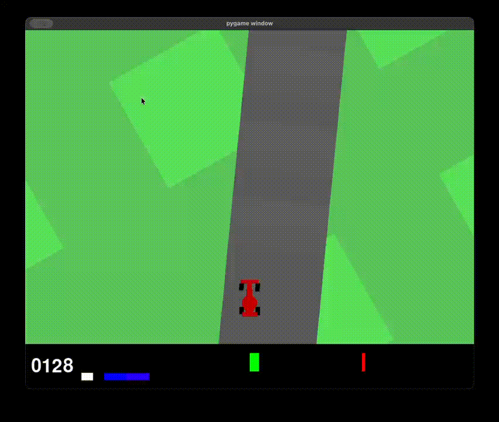

# World Model from Scratch

A from-scratch implementation of the World Models architecture (Ha & Schmidhuber, 2018) built using PyTorch.

### Motivation

The idea of mimicking the human brain in the field of AI has always been an appealing one. The World Model architecture takes, in my opinion, one of the most interesting theories of Cognitive Science, i.e. the fact that we percieve the world through a middle-man, a model shaped by our perception, which is in turn used to make predictions about the future state of said world. These are used to pick the actions that optimize for a certan metric, or a goal.

### Repository Structure

[world-model-from-scratch.ipynb](world-model-from-scratch.ipynb) contains the block-wise implementation of world models, alongside the personal notes I took while replicating this architecture.

### Training

The world model is trained via RL for [car racing](https://gymnasium.farama.org/environments/box2d/car_racing/) in a 2D environment, using CMA. 

### Results

The world model achieved a score of 600 on the car racing task, which is considered to be okay driving. The limiting factor in this instance was training hardware, not an inherent design flaw.
